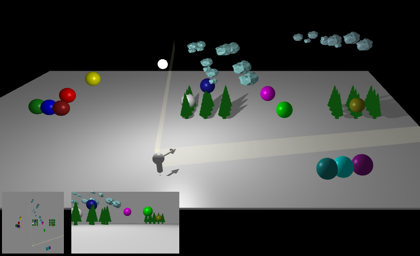

# Into the Woods -- BSP Frustum-Culling Demo

CS174A Fall 2021 Project, UCLA

Team members:

- Nurrachman Liu (rachliu@cs.ucla.edu)
- Adrian Hung
- Nicholas Browning

This is a demo for BSP-based frustum-culling. It contains a user-interactable BSP-tree; on each split (key press `n`), the tree divides the objects it contains into half spaces using a hyperplane. Each successive split recursively divides all leaves into 2 more cells. Turn on BSP-culling (key press `b`) to see the difference, from the exact player's POV! The player's exact POV is drawn globally as well, viewable from the global camera. (Cycle cameras using `t`).

To observe the difference between frustum-culling vs no-culling (regular), culling can be turned on/off (key press `b`).

The interactive player can be moved around (`IJKL` for translation, `QE` for left/right rotation, and `YH` for up/down tilt), independently of the default ('global') camera (`WASD`).

In BSP mode, BSP cells' centers are drawn in spheres colored by cell. To color objects by their BSP cell's color instead, hit `g`.

To turn down LOD (level of detail), hit `u`.

**Example:**
1. Split the scene several times (press `n` several times)
2. Turn on culling (`b`)
3. Rotate the player (`q`,`e`) to see the trees being culled based on what the player is seeing.
4. Cycle to player 1st-person perspective (`t`) to see exactly the FOV the player camera sees, and the trees.
5. Turn off culling (`b`) to see all trees rendered in player perspective.

- The overhead map (bottom left) shows the full map, the player FOV, and the culled objects.
- The off-camera viewport (bottom, right) shows the off-main camera's perspective.

**Full keys:**
*BSP-control:*
- `b`:  Toggle BSP culling on/off.
- `n`:  Split the BSP by 1 level.
- `c`:  Cycle BSP cull-level. (0: fov withut max-distance check; 1: fov with max-distance check).
- `g`:  Color objects by the color of their BSP nodes.

*Misc. Settings:*
- `u`:  Toggle LOD.

*Camera-controls:*
- `t`:  Cycle between player vs global camera.

*Player-controls:*
- `i`: Move forward (w)
- `k`: Move backward (s)
- `j`: Move left (a)
- `l`: Move right (d)
- `q`: Rotate left
- `e`: Rotate right
- `y`: Tilt head up
- `h`: Tilt head down

### Code Location

All of the project code is located in `./project/`. The main graphics code is in `./project/bsp-demo.js`. The backend BSP data structure code is in `./project/bsp.js`.

The back-end `./project/bsp.js` can be run in node-js locally by typing `node bsp.js`.

The application is run by lauching the local python web server `./host` or `./host.command` and then going to localhost:8000 in your browser.

### References

https://github.com/Robert-Lu/tiny-graphics-shadow\_demo

http://learnwebgl.brown37.net/08\_projections/projections\_viewport.html

https://en.wikipedia.org/wiki/Binary\_space\_partitioning

